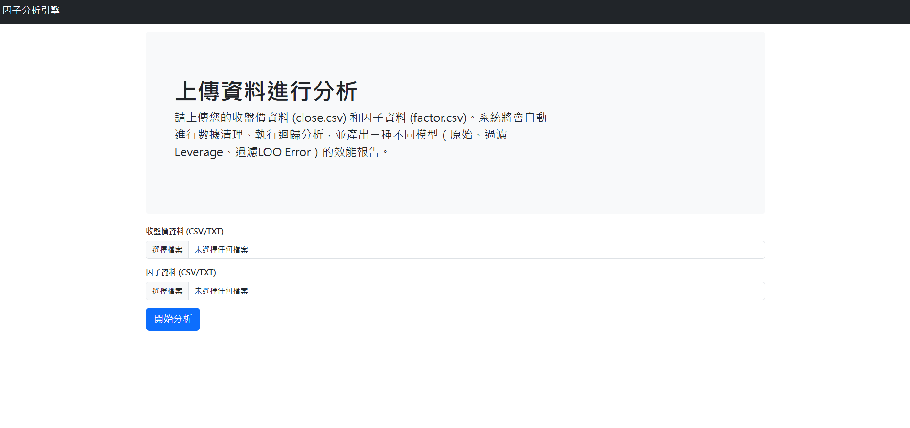

# 因子迴歸分析引擎

這是一個簡易的 Web 應用程式，用於分析股票因子與報酬率之間的關係。使用者可以上傳包含收盤價和因子數據的兩個 CSV 檔案，系統會自動進行數據清理、執行三種不同的迴歸模型，並回傳一份效能比較報告。



---

## 功能

- **Web 介面**：透過簡單的網頁介面即可上傳資料並查看結果，無需編寫任何程式碼。
- **自動化資料清理**：自動移除缺失值過多或數據長度不一致的公司資料。
- **多模型分析**：
    1.  **原始 OLS 迴歸**：一個基準模型。
    2.  **過濾高 Leverage**：移除具有高槓桿值的觀察點後重新建立模型，以降低異常值的影響。
    3.  **過濾高 LOO Error**：移除 Leave-One-Out (LOO) 誤差最大的觀察點後重新建立模型，是另一種處理影響點的方法。
- **動態報告生成**：自動生成一個清晰的表格來比較不同模型的 RMSE (均方根誤差) 與其他診斷指標。

## 專案結構

```
.
├── app.py              # Flask Web 應用程式
├── engine.py           # 核心分析引擎 Class
├── requirements.txt    # Python 依賴套件
├── README.md           # 本說明文件
├── templates/          # HTML 網頁模板
│   ├── index.html      # 上傳頁面
│   ├── layout.html     # 基礎樣式頁面
│   └── results.html    # 結果顯示頁面
└── uploads/            # 存放使用者上傳的暫存檔案
```

## 安裝與設定

**1. 環境要求**
- Python 3.7+

**2. 複製專案**

```bash
git clone <your-repository-url>
cd MR
```

**3. 安裝依賴套件**

在專案根目錄下，執行以下指令來安裝所有必要的 Python 套件：

```bash
pip install -r requirements.txt
```

## 如何使用

1.  **啟動 Web 應用程式**

    在專案根目錄下，執行以下指令：

    ```bash
    flask run
    ```

    或者

    ```bash
    python app.py
    ```

    啟動成功後，您會看到類似以下的訊息：
    ```
     * Running on http://127.0.0.1:5000
    ```

2.  **開啟瀏覽器**

    打開您的網頁瀏覽器，並前往 `http://127.0.0.1:5000`。

3.  **上傳檔案**

    - 在「收盤價資料」欄位，選擇您的價格資料 CSV 檔案。
    - 在「因子資料」欄位，選擇您的因子資料 CSV 檔案。
    - **注意**：檔案必須是 `utf-16` 編碼且以 tab (`	`) 分隔的格式，如同原始腳本中的讀取設定。

4.  **開始分析**

    點擊「開始分析」按鈕。系統會處理您的資料並在新的頁面顯示分析結果報告。

## 直接使用分析引擎 (進階)

您也可以在其他的 Python 腳本中直接匯入並使用 `AnalysisEngine`。

```python
from engine import AnalysisEngine

# 初始化引擎，傳入檔案路徑
engine = AnalysisEngine(data_path='path/to/your/data.csv', factor_path='path/to/your/factor.csv')

# 執行分析 (可傳入不同的時間參數)
engine.run_analysis(
    train_return_time=202412, 
    train_predictor_time=202411, 
    test_return_time=202501, 
    test_predictor_time=202412
)

# 獲取結果報告
summary_df = engine.get_summary_report()

print(summary_df)
```
